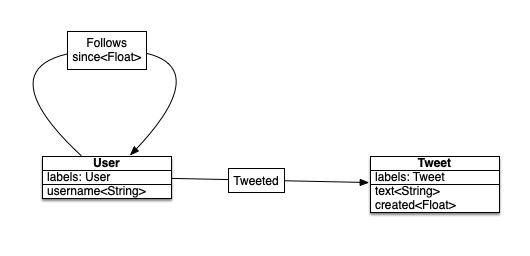
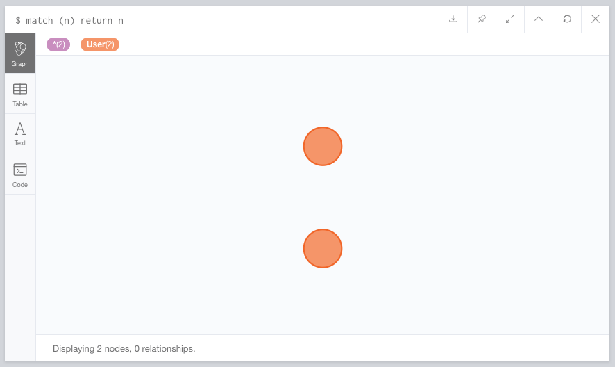
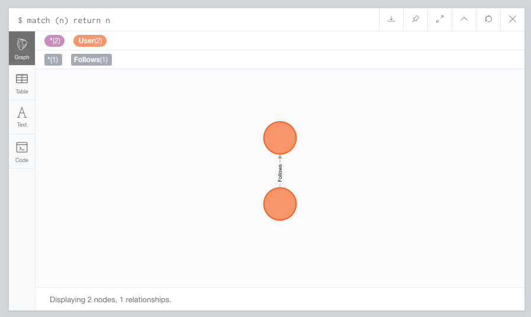
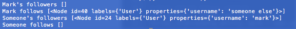
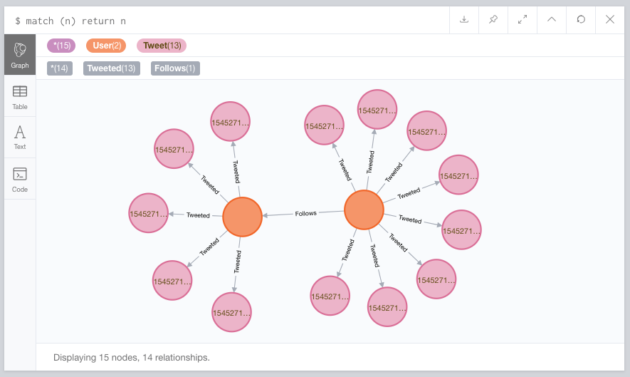
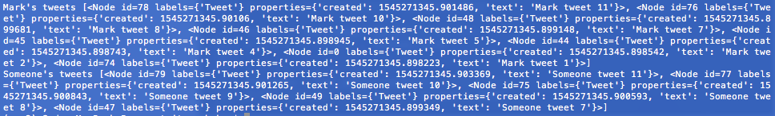

# MOESHA

A Python Data Mapper for Neo4j. Moesha is easy to use and follows a few simple principles:

* Entities (Node, Relationship) objects are dict-like P.O.P.O.s (plain ol python objects...with a little bit of extra functionality).
* Mappers handle all of the work, they translate those entities into Cypher queries based on the actions taken aginst them.
* Moesha tries to to take a query-first approach. Everything that is done can be seen as a simple Cypher query and users can skip interacting with Entities all together and simply pass queries around.

## Quickstart

Since Moehsa is in a very early alpha stage, I will show you how it works. Lets model a simple Twitter-like graph with Moesha given these rules:

* Users can follow other users
* Users can tweet text



Given this data model we will need to define:

* `User <Node>` to store all information for user accounts
* `Tweet <Node>` to store all information for tweets
* `Follows <Relationship>` that will define when one `User` follows another `User`. This will also store the date that the follow happend.
* `Tweeted <Relationship>` that will connect a user `User` to a `Tweet`

### Installation

```
python setup.py install
```

### Code

We'll walk through building this model out using Moesha. The first step is to import all of the needed classes

```python
from datetime import datetime

from moesha.connection import Connection
from moesha.entity import Node, Relationship
from moesha.mapper import Mapper, EntityNodeMapper, EntityRelationshipMapper
from moesha.property import String, DateTime, RelatedEntity
```

* `Node` and `Relationship` are the base classes for our P.O.P.O.s
* `Mapper` is the main interface that we'll be using to map our entites to the graph.
* `EntityNodeMapper` and `EntityRelationshipMapper` will be used as base classes for our optional custom `Node` and `Relationship` mappers
* `String`, `DateTime`, and `RelatedEntity` are properties that we will define in our custom mappers that describe how the entities will be translated into Cypher queries

We start by making the connection to our Neo4j instance and defining our main `Mapper` oject.

```python
connection = Connection(host='127.0.0.1', port='7687' 
    username='neo4j', password='test')
mapper = Mapper(connection)
```

Next we'll build the `Relationship` entities and their mappers (this is because we're going to refrence is in the `Node` mappers)

```python
class Tweeted(Relationship):
    pass


class TweetedMapper(EntityRelationshipMapper):
    entity = Tweeted


class Follows(Relationship):
    pass


class FollowsMapper(EntityRelationshipMapper):
    entity = Follows
    __PROPERTIES__ = {
        'since': DateTime(default=datetime.now),
    }
```

Now it is time to build the `Node` objects and their mappers.

```python
class User(Node):
    pass


class UserMapper(EntityNodeMapper):
    entity = User
    __PROPERTIES__ = {
        'username': String(),
    }
    __RELATIONSHIPS__ = {
        'Follows': RelatedEntity(relationship_entity=Follows,
            ensure_unique=True),
        'Followers': RelatedEntity(relationship_entity=Follows,
            ensure_unique=True, direction='in'),
        'Tweets': RelatedEntity(relationship_entity=Tweeted,
            ensure_unique=True),
    }


class Tweet(Node):
    pass


class TweetMapper(EntityNodeMapper):
    entity = Tweet
    __PROPERTIES__ = {
        'created': DateTime(default=datetime.now),
        'text': String(),
    }
```

As you can see in the `UserMapper` we define a few relationships, `Follows` and `Followers` are an inverse of the `Follows` relationship, `Tweets` simply links the `User` to a `Tweet`.

We're done building out the structure, time to add some data.

```python
mark = mapper.create(entity=User, properties={'username': 'mark'})
someone = mapper.create(entity=User, properties={'username': 'someone else'})
```

This defines two users, while you can call the `User` constructor directly, it is best to use the `Mapper` instance to create them because a custom mapper could redefine what happens during entity creation.

Time to save the users.

```python
work = mapper.save(mark, someone)
work.send()
```

Each action taken aginst the mapper creates a unit of work `moesha.mapper._Unit` and returns a `moesha.mapper.Work` controller object.

> It is useful to pass around the `Work` object when interacting with the `Mapper` to create a queue of queries to be run, you will see this shortly

At this point we have two entities in the database



Mark should follow someone

```python
user_mapper = mapper.get_mapper(User)
follow_relationship_entity, work = user_mapper(mark)['Follows'].add(someone)
work.send()
```

There is a lot going on here

* `user_mapper = mapper.get_mapper(User)` we get the custom mapper for `User` objects
* `user_mapper(mark)` sets the context for the `user_mapper` to be the `mark` object
    * `['Follows]` gets the `RelatedEntity` defined under the 'Follows' name
    * `.add(somone)` will make the connection `(mark:User)-[:Follows]->(someone:User)`
        * That returns the newly defiend `Relationship` object and the `Work` controller
* `work.send()` processes all of the `_Unit` objects defined and will send each query to the graph



Lets get a list of mark's followers and who he is following

```python
followers = user_mapper(mark)['Followers']()
print('Mark\'s followers', followers.data)

follows = user_mapper(mark)['Follows']()
print('Mark follows', follows.data)

# do the same for someone
followers = user_mapper(someone)['Followers']()
print('Someone\'s followers', followers.data)
```



Add some tweets for each user:

```python
work = mapper.get_work()

for i in range(12):
    if i % 3:
        tweet1 = mapper.create(entity=Tweet, properties={
                'text': 'Mark tweet {}'.format(i),
            })
        _, work = user_mapper(mark)['Tweets'].add(tweet1, work=work)

    if i > 6:
        tweet2 = mapper.create(entity=Tweet, properties={
                'text': 'Someone tweet {}'.format(i),
            })
        _, work = user_mapper(someone)['Tweets'].add(tweet2, work=work)

work.send()
```

This adds six tweets for someone and eight for mark.



Finally, we'll pull back all of the tweets

```python
marks_tweets = user_mapper(mark)['Tweets']()
someones_tweets = user_mapper(someone)['Tweets']()

print('Mark\'s tweets', marks_tweets.data)
print('Someone\'s tweets', someones_tweets.data)
```



> all of the code is in `example/tweets.py`

Full documentation coming soon